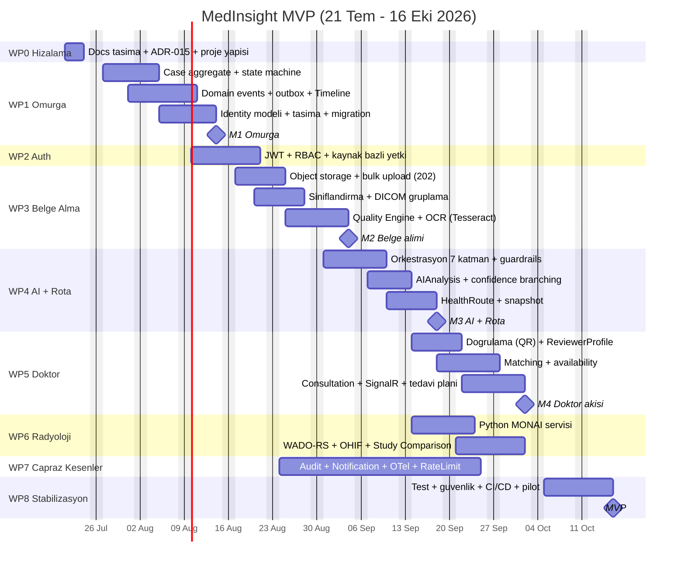

# MedInsight MVP Yol Haritası

> Durum: Taslak v1 — 2026-07-21
> Kaynak: `project_arch/` dokümantasyon setinin sentezi (Analiz Raporu v1, ADR-001…014, mimari/backend/AI dokümanları).
> Hedef: ~90 günde MVP (bkz. Analiz Raporu §17) — bitiş hedefi **16 Ekim 2026**.

## İlkeler

- **Docs-first:** Kod dokümanı takip eder. Domain kuralı değişen her PR ilgili `docs/domain/` dosyasını aynı PR'da günceller.
- **Dikey dilim:** Paketler, event-storming'deki ana akışı ("MR yükle → vaka kapat") uçtan uca kuracak sırada.
- **Seam'leri şimdi, özellikleri sonra:** Billing, Hospital, Agent Ecosystem, Knowledge Graph şema olarak hazır ama boş (ADR-008).

## İş Paketleri

### WP0 — Hizalama ve Dokümantasyon (21–24 Tem)
- `project_arch/` md dokümanlarını `docs/` altına kanonik yapıda taşı (en güncel event catalog: escalation-trigger kopyası).
- ADR-015: .NET 9 kararı (dokümanlar .NET 8 diyordu).
- Proje yapısı: `MedInsight.Shared` ve `MedInsight.Reporting` kaldırılır; `MedInsight.AIOrchestration` ve `MedInsight.TimelineService` eklenir; `MedInsight.Dicom` ingestion için kalır.
- **Çıktı:** Repo = tek kaynak; yapı dokümanlarla uyumlu.

### WP1 — Çekirdek Omurga (27 Tem – 14 Ağu) ★ M1
- `Case` aggregate root + 7 durumlu yaşam döngüsü state machine (ADR-001).
- Domain event altyapısı: ortak zarf (eventId, caseId, correlationId, causationId), in-process publisher + outbox tablosu.
- Timeline Engine: pasif abone, append-only `timeline_entries`, `(case_id, occurred_at)` indeksi (ADR-006).
- Identity temel modeli: `User` + `Patient`/`Doctor`/`Caregiver` profilleri, `CaseMember` (rol + yetki seviyesi).
- Sprint 1 modelinin taşınması (Patient/Study/Series → yeni yapı), kavram bazlı Domain klasörleri, `snake_case` tablolar, migration reset.
- **DoD:** Vaka aç → durum geçişi → event → timeline kaydı zinciri testlerle çalışıyor. Domain testleri ≥ %90.

### WP2 — Kimlik Doğrulama ve Yetki (10–21 Ağu)
- JWT auth, RBAC + kaynak bazlı ikinci katman yetki (doktor yalnız kendi konsültasyonuna erişir).
- Yetki matrisi (Analiz Raporu §14) endpoint'lere uygulanır; KVKK veri sınıflandırması temeli.
- **DoD:** Tüm mevcut endpoint'ler iki katmanlı yetkiden geçiyor.

### WP3 — Belge Alma Hattı (17 Ağu – 4 Eyl) ★ M2
- Object storage (S3 uyumlu / MinIO) + bulk upload: 202 Accepted, Idempotency-Key, resumable, 800+ dosya.
- Ingestion: kural tabanlı sınıflandırma (DICOM magic number, MIME), DICOM gruplama (StudyInstanceUID + bekleme penceresi), `RoutingDecided` (ingestion-pipeline.md).
- Document Quality Engine: plugin mimarisi + MVP kriterleri (DICOM Integrity, OCR Score, Missing Pages, Duplicate).
- Text Extraction Service: `IOcrProvider` soyutlaması, Tesseract varsayılan (ADR-011).
- **DoD:** Toplu DICOM+PDF yüklemesi sınıflandırılıp kalite skoru alıyor, timeline'a düşüyor.

### WP4 — AI Orkestrasyon ve Sağlık Rotası (31 Ağu – 18 Eyl) ★ M3
- `MedInsight.AIOrchestration`: 7 katman iskeleti (Intent → Planner → Agent Selection[=Hızır] → Tools → Memory → Reasoning → Response).
- Guardrails 3 kapı: güven eşiği (tek global config), kapsam kontrolü + prompt-injection savunması, kaynak izlenebilirliği; PII minimizasyonu.
- `AIAnalysis` + `AIFindings` (Source: LLMTextAnalysis/OpenSourceImageModel); confidence branching (ADR-004: paralel iki event).
- HealthRoute + append-only `health_route_snapshots` (ADR-002); Hızır persona/response katmanı.
- `DifferentialDiagnosis` kararı bu paket başında netleşir (CDSS sınırlarıyla).
- **DoD:** Yüklenen rapor → AI ön analiz → rota snapshot → hasta bildirimi akışı çalışıyor; guardrail testleri geçiyor.

### WP5 — Doktor Tarafı (14 Eyl – 2 Eki) ★ M4
- Doktor doğrulama: belge + QR parse → admin onayı (ADR-007); `ReviewerProfile`.
- Doctor Matching: 5 faktörlü konfigüre edilebilir skorlama, max 5 öneri, atama yok (ADR-003); availability modeli (ADR-009).
- Consultation: SignalR mesajlaşma, klinik not, AI analiz inceleme (`AIAnalysisReviewed`), tedavi planı → zorunlu rota snapshot'ı.
- Escalation trigger MVP davranışı: `EscalationSuggested` → öncelik + not, vendor çağrısı yok (ADR-014).
- **DoD:** Doktor doğrulanıyor, öneriliyor, vakaya giriyor, AI analizini inceleyip tedavi planı yazabiliyor.

### WP6 — Radyoloji ve Görüntüleme (14 Eyl – 2 Eki, WP5 ile paralel)
- Python FastAPI Radiology Inference Service: MONAI + nnU-Net/BraTS, yalnızca bilgilendirici, zorunlu disclaimer (ADR-010).
- Minimal WADO-RS servisi (object storage önü, PACS değil) + OHIF Viewer entegrasyonu ve bağlam katmanı (ADR-012).
- Study Comparison: hibrit tetikleme, çift güven katmanı (ADR-013).
- **DoD:** DICOM serisi OHIF'te açılıyor; deneysel segmentasyon bulgusu ayrı blokta, disclaimer'lı görünüyor.

### WP7 — Çapraz Kesenler (24 Ağu – 25 Eyl, sürekli bant)
- Audit Service: event handler'lardan append-only yazım, DB seviyesinde UPDATE/DELETE yasağı.
- Notification Engine: tek kanal MVP (push), tercih + log tabloları.
- Observability: OpenTelemetry (log/trace/metric), correlationId zorunlu; rate limiting + `Retry-After`.
- **DoD:** Kritik aksiyonlar audit'te; bildirimler event'ten akıyor; uçtan uca trace görülebiliyor.

### WP-LLM — Gerçek LLM Sağlayıcı Entegrasyonu (tarih esnek, WP8'den önce)
- `ClaudeLlmClient : ILlmClient` implementasyonu (bkz. `src/MedInsight.AIOrchestration/DependencyInjection.cs` içindeki `TODO(llm-provider)`).
- Sağlayıcı seçimi `Ai:Provider` config anahtarına bağlanır; API anahtarı secrets manager'dan.
- Guardrails/persona/pipeline değişmez — StubLlmClient dev/test için kalır.
- **DoD:** Gerçek model ile analiz üretiliyor; guardrail testleri gerçek çıktıyla da geçiyor.

### WP8 — Stabilizasyon ve Pilot (5–16 Eki) ★ MVP
- Test kapsama hedefleri, güvenlik/KVKK gözden geçirmesi, yük testi (bulk upload).
- CI/CD: build → test → statik analiz → staging otomatik → prod manuel onay.
- Pilot senaryosu: Analiz Raporu §17'deki 10 adımın uçtan uca gösterimi.

## Kilometre Taşları

| # | Tarih | Kriter |
|---|---|---|
| M1 | 14 Ağu | Omurga: Case + event + timeline zinciri çalışıyor |
| M2 | 4 Eyl | Uçtan uca belge alımı (bulk, kalite skorlu) |
| M3 | 18 Eyl | AI ön analiz + sağlık rotası snapshot akışı |
| M4 | 2 Eki | Doktor akışı tamam (doğrulama→eşleştirme→konsültasyon→plan) |
| MVP | 16 Eki | Pilot senaryo uçtan uca, staging'de |

## Gantt

## Bağımlılıklar

- WP1 → her şeyin ön koşulu (event omurgası).
- WP2, WP3'ten önce bitmeli (upload endpoint'leri yetki ister).
- WP4, WP3'ün sınıflandırma/kalite çıktısına bağlı.
- WP5 ve WP6 paralel; ikisi de WP4'ün event'lerini tüketir.
- WP7 sürekli bant: Audit/Notification aboneleri WP1 event altyapısı biter bitmez başlar.

## Kapsam Dışı (ADR-008)

Canlı video, sigorta, hastane paneli, e-Nabız, PACS, ödeme akışı, araştırma modülü, çoklu-ajan ekosistemi, Medical Knowledge Graph.
